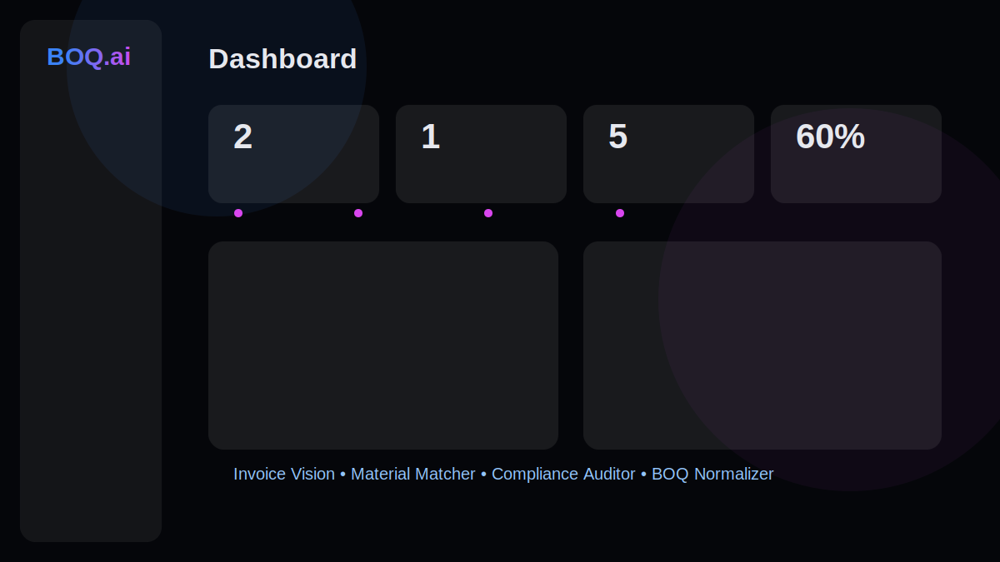
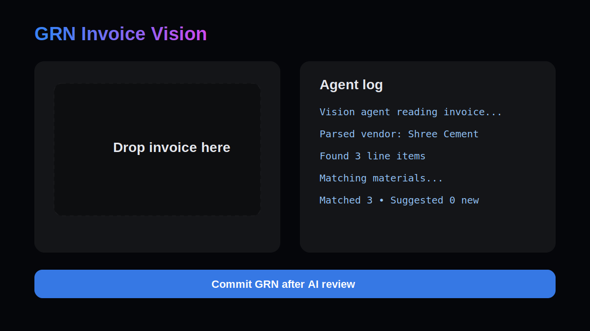
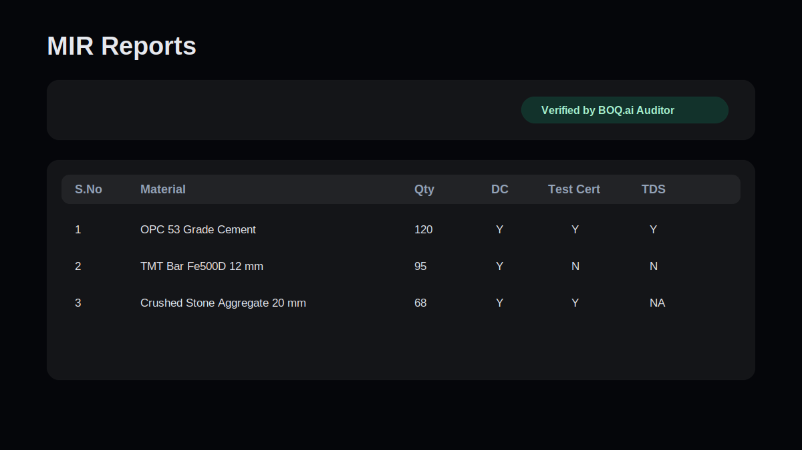

# BOQ.ai

BOQ.ai is a hackathon-ready construction BOQ and GRN demo that puts four AI agents on a 3-minute workflow:

- Invoice Vision extracts supplier invoice fields and line items.
- Material Matcher reconciles invoice descriptions to the master material library.
- Compliance Auditor verifies Test Certificates and TDS documents.
- BOQ Normalizer maps messy Excel BOQs into structured packages, headlines, and line items.

## Stack

- Next.js 16 App Router, TypeScript, React 19
- Supabase Postgres, Storage, permissive demo RLS
- Tailwind v4, shadcn/ui, lucide-react, sonner
- OpenAI SDK with `gpt-4o` vision and `gpt-4o-mini` structured extraction
- SheetJS, jsPDF, jspdf-autotable

## Environment

Create `.env.local` from `.env.local.example`:

```bash
NEXT_PUBLIC_SUPABASE_URL=
NEXT_PUBLIC_SUPABASE_ANON_KEY=
SUPABASE_SERVICE_ROLE_KEY=
OPENAI_API_KEY=
```

Never expose `SUPABASE_SERVICE_ROLE_KEY` or `OPENAI_API_KEY` in client code.

## Run Locally

```bash
npm install
npm run dev
```

Open `http://localhost:3000` and sign in with:

```text
demo / demo
```

## Database

Apply migrations in Supabase SQL Editor:

- `supabase/migrations/001_boqai_init.sql`
- `supabase/migrations/002_boq.sql`

Then seed the demo:

```bash
npx tsx scripts/seed-demo.ts
```

The seed creates sites, suppliers, 30 materials, BOQ rows, committed GRNs, and compliance documents.

## Demo Loop

1. Dashboard: show live KPIs and AI capability pills.
2. GRN: upload an invoice, watch Vision and Matcher logs, review matched materials, commit.
3. Compliance: upload or re-audit docs and show flagged AI findings.
4. MIR Reports: select a GRN date and download the verified report PDF.
5. BOQ: import Excel and show the Normalizer column map.

## Screenshots







## Useful Commands

```bash
npm run lint
npm run build
npx tsx scripts/seed-demo.ts
```

## Deploy

Deploy to Vercel, add the same environment variables, and keep the Supabase bucket `boqai-docs` private.
